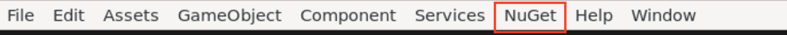
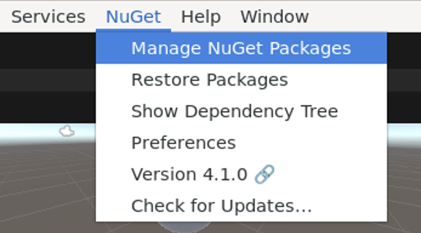
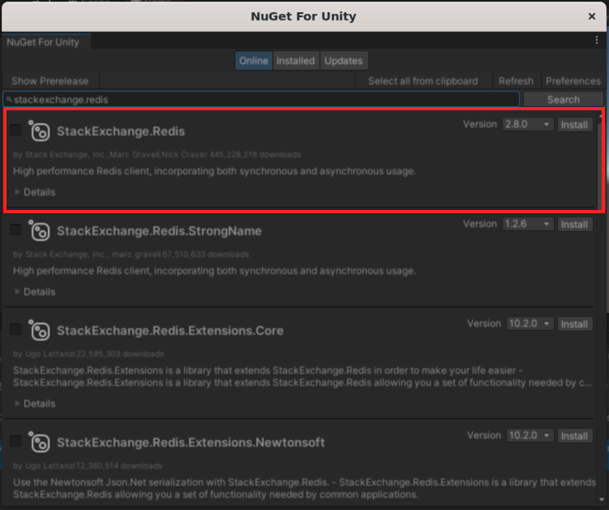

## Working with Redis in Unity
This is a guide on how to integrate Redis with Unity within the BRAND framework. For full implementation, refer to sample_unity_game

### Getting Started
Make sure Unity is installed and running on your local machine. For more instructions and details, visit Unity's [documentation](https://learn.unity.com/tutorial/install-the-unity-hub-and-editor#).

### Requirements
- `Unity 2022.3` or `Unity 6 (6000.0.25f1)`
- `StackExchange.Redis`: the client library that we will be using to interface with Redis. 
    - This library is a NuGet library, which is a popular package manager for C#/.NET. However, NuGet is not directly supported in Unity, so we will need to install a NuGet client to run inside of Unity Editor, called `NuGetForUnity`. 
    - In the next section, we will explore how to install `NuGetForUnity`, `StackExchange.Redis`, and any relevant components to get it ready to use in Unity.

### Set up - Installing NuGetForUnity and StackExchange.Redis
1. Install `NuGetForUnity` (easiest way):
    - Install the provided Unity package into your Unity project. Located [here](https://github.com/GlitchEnzo/NuGetForUnity/releases).
    - Download the `*.unitypackage` file. Right-click on it in File Explorer and choose "Open in Unity."
    - Once done, you should see a `NuGet` tab in the menu.
    
    
    Note: For other installation options, visit this [here](https://github.com/GlitchEnzo/NuGetForUnity?tab=readme-ov-file#how-do-i-install-nugetforunity)
2. Select `NuGet` -> `Manage NuGet Packages` to open the package manager.
    
3. Search for and install `StackExchange.Redis`. Make sure it is version 2.8.0. This will install a package in your `Assets/Packages` folder.
     
4. Search for an install `NuGet.CommandLine` version 6.10.0
5. Search for and install `System.Runtime.CompilerServices/Unsafe` version 6.0.0

### Using Redis in C#/.NET
This script is an adaptation of Redis' [documentation](https://redis.io/learn/develop/dotnet/streams/stream-basics). 

1. Declare all the necessary namespaces:
    ```
    using System.Collections;
    using System.Collections.Generic;
    using UnityEngine;
    using StackExchange.Redis;
    using System.Threading.Tasks; // required for running the async xrange query
    using System.Linq; // required for parsing Redis stream query results
    ```
2. Initialize the multiplexer:
    
    `StackExchange.Redis` uses the `ConnectionMultiplexer` to handle the commands that you send to Redis. Therefore, the first thing to do is to initialize `ConnectionMultiplexer` and establish a connection to Redis. Once you're connected, the next thing is to grab the correct database in the Redis instance (usually defaulted to database 0).
    ```
    ConnectionMultiplexer redis;
    IDatabase db;

    redis = ConnectionMultiplexer.Connect("localhost");
    db = redis.GetDatabase();
    ```
    This is taken care for you in Node.cs, which is the c# implementation of the BRAND node. When you create an instance of a BRAND node, these functions are called in the constuctor. 

3. Create a XREAD task:

    In `StackExchange.Redis`, there are multiple functions that mimic Redis commands, such as `xadd`, `xread`, `xrange`, etc. Each Redis command has 2 functions, one synchronous, and one asynchronous (eg, `StreamRange` and `StreamRangeAsync`). You can learn more about asynchronous programming [here](https://learn.microsoft.com/en-us/dotnet/csharp/asynchronous-programming/), but it is generally recommended to use async since it helps lighter the IO workload. The general idea is that we don't want the read/write functions to hold up Unity engine and result in a slower frame rate or faulty implementation of game logic. 

    ```
    public async Task ReadFromStream(string channelName)
    {
        while (Application.isPlaying)
        { 
            await Task.Run(async () =>
            {
                var result = await _database.StreamRangeAsync(channelName, "-", "+", 1, Order.Descending);
                if (result.Any()) 
                {
                    StreamDataDict[channelName] = ParseResult(result); //ParseResult() is a helper function (Refer to Node.cs for details)
                }
                else
                {
                    Debug.LogWarning($"No entries found for stream: {channelName}");
                    return; 
                }
            });
        }
        Debug.LogWarning("Application is not playing. Stopping reading from Redis stream.");
    }
    ```
## Integrating Unity, BRAND, and Redis
The central object in `Node.cs` is the `BRANDNode` class in the `BRANDForUnity` namespace. This object is essentially a replica of the Python [`BRANDNode`]. 

Ideally, `BRANDNode` should be treated as a singleton object. `BRANDNode` uses the `ConnectionMultiplexer` class from `StackExchange.Redis`, which is designed to be *shared and reused*. Therefore, to avoid unnecessary overhead, `BRANDNODE` should be initialized once in your entire project.

Let's first create the `BRANDNode` object. `BRANDNode` requires info about the graph in order to connect to your `Redis` server and acquire relevant node parameters.
```
using BRANDForUnity;
...
string args = "-n sample_unity_game -i localhost -p 6379";
BRANDNode node = new BRANDNode(args.Split(' '));
...
```
These arguments will be parsed and used to create a connection to Redis. The node's parameters within the supergraph will also be parsed to identify streams that should be listened to and `StartListenersFromGraph` will initiate listeners. 
```
public BRANDNode(string[] args)
{
    //initializing dictionaries
    StreamDataDict = new Dictionary<string, Dictionary<string, object>> ();
    _parameters = new Dictionary<string, object>();

    ParseRedisArguments(args);
    ConnectToRedis();
    StartListenersFromGraph();
}
```
One point of difference between this c# implementation and the original implementation is that the BRANDNode class has a public attribute, `StreamDataDict`, which stores data being read from streams. To access data from within the game, index into StreamDataDict. 
```
BRANDNode.StreamDataDict["game_data"]["cursor_x"];
```

TODO: add instructions for how to run the game from cli

Once you have a `BRANDNode`, there are 2 things you might want to do:
- Writing to a `Redis` stream
- Reading from a `Redis` stream

### Writing to a Redis stream

To write to a `Redis` stream, we will use the `StreamWriteAsync` function. 
```
public async Task WriteToStream(string key, Dictionary<string, string> entries)
{
    var nameValueEntries = entries.Select(kvp => new NameValueEntry(kvp.Key, kvp.Value)).ToArray();
    await _database.StreamAddAsync(key, nameValueEntries);
}
```
Given a dictionary named `gameDataDict` we can write it to a `Redis` stream with key `game_data`
```
gameDataDict = new Dictionary<string, string>
{
    { "cursor_x", "10" },
    { "cursor_y", "15" },
    { "click", "1" }
};

node.WriteToStream("game_data", gameDataDict); 
```

### Reading from a Redis stream

To read from a `Redis` stream, we'll use the `StreamRangeAsync` function. `StackExchange.Redis` provides a synchronous and asynchronous version of any `Redis` commands. But if your node performs a lot of simultaneous reads, it is recommended to use the async functions. This example assumes you are making multiple read requests. `ReadFromStream` function is implemented in `Node.cs`
```
public async Task ReadFromStream(string channelName)
{
    while (Application.isPlaying)
    { 
        await Task.Run(async () =>
        {
            var result = await _database.StreamRangeAsync(channelName, "-", "+", 1, Order.Descending);
            if (result.Any()) 
            {
                StreamDataDict[channelName] = ParseResult(result);
            }
            else
            {
                Debug.LogWarning($"No entries found for stream: {channelName}");
                return; 
            }
        });
    }
    Debug.LogWarning("Application is not playing. Stopping reading from Redis stream.");
}
```
`StreamRangeAsync` returns a list of stream entries matching your request. This specific implementation of `StreamRangeAsync` is exactly similar to `XREVRANGE`, where the latest entry is returned first.

Each stream entry has an entry ID. Feel free to store the latest entry ID to optimize your request next time. 

Extending the same example from above, we can read in from a stream with key `game_data` like so
```
node.ReadFromStream("game_data");
```
Note that because `ReadFromStream` has a while loop, the function only needs to be called once, ideally not in the `Update` function. In so far as there is a stream with a matching key, `ReadFromStream` will continue to read in data and store it in `StreamDataDict`. `StartListenersFromGraph` calls `ReadFromStream` for each stream specified in the node's parameters of the supergraph file. 

To access data from a stream, call `BRANDNode.StreamDataDict`. 
```
void Update()
{
    cursor_x = BRANDNode.StreamDataDict["game_data"]["cursor_x"];
}
```

### Troubleshooting
- If your code gives an error "Could not load file or assembly Systeym.Runtime.CompilerServices.Unsafe", install `System.Runtime.CompilerServices.Unsafe` using `NuGetForUnity`.